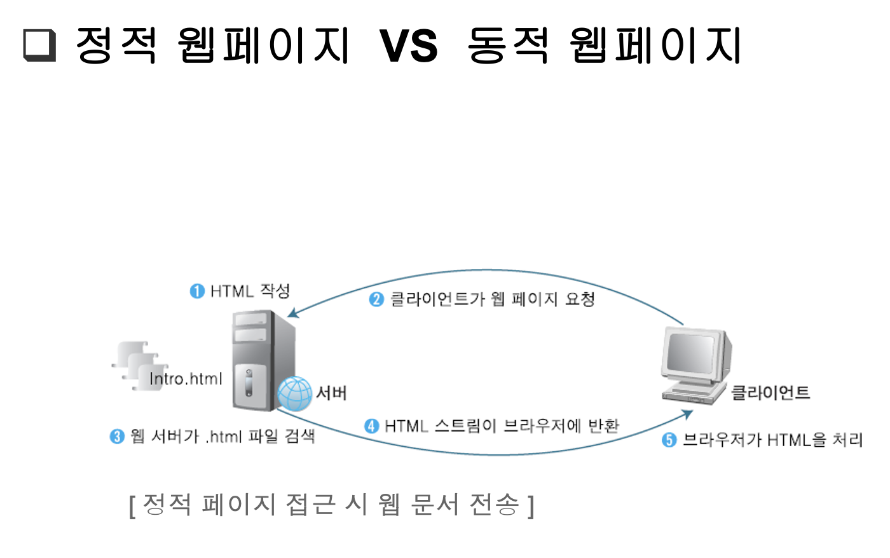
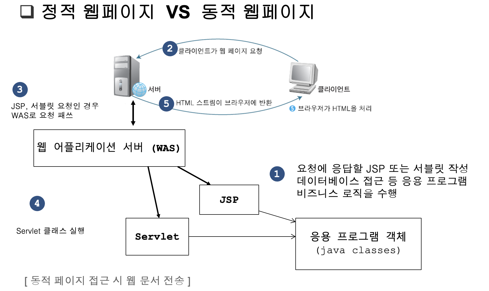

# BitAcademy Write Note

## `07월 06일`

### 자바 백앤드 전체 그림
- java programming
- Database programming - sql + jdbc programming
- x network programming
- Web Programming (Servlet/JSP)
- Framework (Spring MVC, Spring Boot)

이러한 순서로 배우면 된다.

-------------------------linux기반 ----------------------------


> 백앤드 개발자 과정
>> - 다 배우고 기업을 들어가야하는건 아니지만 들어가서 다 배울 것임
>> - 기본적으로 웹 어플리케이션 정도는 만들 수 있어야 함
>> - 어느정도 코딩이 되면 그 다음 성능 향상 etc..

<br></br>

# 데이터베이스

## 쿼리 실행 순서
1. From table
2. where condition
3. select column
4. order by
    - asc 오름차순 default 
        - ex) 1 2 3 4 5
    - desc 내림차순 
        - ex) 5 4 3 2 1
---
## 통계 함수
- avg, min, max, count, sum etc..

`table: employees`
| emp_no | salary | hire_date|
|:---:|:---:|:---:|
|1|100|~|
|1|200|~|
|2|300|~|
|3|400|~|
|4|100|~|

```sql
select sum(salary), emp_no
from employees;
```
- select 절에 그룹함수가 있는 경우, 어떤 컬럼도 select절에 올 수 없다.
- emp_no 는 아무 의미없다. -> 오류임.
> group by의 필요성
> group by 는 having을 통해 condition 생성

---
## query실행 순서
```
1. From table
2. Where cond
3. Group by column
4. Having cond
5. Order by
6. select
```

<br>

---
## Join
---
## `07월 07일`
---

- WorkBench ERD 만드는 방법


> 데이터베이스 이름과 같게 스키마를 설정해야한다.


> ADD ERD


> add table


> 일 대 다 관계 생성
>> 다 관계를 먼저 클릭


> continue 클릭
>> 데이터베이스에 삽입
>>> 모두 초록색 표시가 뜨면 완료

---
## DDL (Date Definition Language)
--- 
## transaction
- 강사님이 해준 트랜잭션 예시 정리가 필요함 .
--- 
## JDBC
### `- 자바 프로그램내에서 SQL문을 실행하기 위한 자바 API`

자바에서는 Connection c = new getConnection()이랑 
query만 날리는 것만 구현하도록 하고 

mysql 과 oracle 등에서 get connection을 구현하도록 만든다.

JDBC driver : 

mysql DBMS와 연결하기 위해서는 mysql JDBC dirver가 필요함 .

우리는 JDBC의 프로그램 인터페이스를 코딩하면 됨. 

driver manager로 dirver를 관리

mysql 과 oracle의 패키지 이름정도는 알아야한다. 

### `-JDBC Eclipse에서 사용하기`
1. Maven Module생성
2.  [mvrepository](https://mvnrepository.com/artifact/org.mariadb.jdbc/mariadb-java-client) 사이트에서 사용할 버전에 대한 dependency를 pom.xml에 dependencies태그 안에 추가
```xml
<project xmlns="http://maven.apache.org/POM/4.0.0" xmlns:xsi="http://www.w3.org/2001/XMLSchema-instance" xsi:schemaLocation="http://maven.apache.org/POM/4.0.0 https://maven.apache.org/xsd/maven-4.0.0.xsd">
  <modelVersion>4.0.0</modelVersion>
  <parent>
    <groupId>com.bit.mariaDB</groupId>
    <artifactId>mariaDB</artifactId>
    <version>0.0.1-SNAPSHOT</version>
  </parent>
  <artifactId>jdbc_practice</artifactId>
  <!-- https://mvnrepository.com/artifact/org.mariadb.jdbc/mariadb-java-client -->
	<dependencies>
		<dependency>
		    <groupId>org.mariadb.jdbc</groupId>
		    <artifactId>mariadb-java-client</artifactId>
		    <version>3.0.8</version>
		</dependency>
	</dependencies>
</project>
```
> 3.0.8 버전을 사용하였음.
3. pom.xml을 바꿨으니 update project클릭


---
## `0710`
---
### - 보통의 웹사이트 로그인 방법

```java
String SQL = "select no,name " + 
    "from user " + 
    "where id='" + id + "'" + 
    "and pwd='" + pwd "'";
```
> 이러한 쿼리를 날려서 로그인한다.

    - 위 쿼리의 문제점
        로그인창에 
        'or 2-1=1 or "= ' 와 같은 쿼리를 날려 모든 사용자의 정보를
        볼 수 있다.
> 이러한 것을 SQL Injection이라고 함.
--- 
### - Solution : PreparedStatement

1. preparedStatement를 JDBC 드라이버에 준비를 시킴
2. binding을 통해 ?,? 자리를 필요한 정보로 bind시켜줌 
3. 그럼 드라이버가 쿼리를 만들어 execute한다. 
--- 
### DAO (Data Access Object)

- DB를 사용해 데이터를 조회하거나 조작하는 기능을 전담하도록 만든 Object
- DB CRUD를 전담하는 Controller
- request, response 순서
    - Request : Application -> DAO -> DB
    - Response : DB -> DAO -> APP
--- 
### DAO-VO 패턴 (Employees테이블 실습)

`Hr`

hr.dao

|-- EmployeeDao

hr.dao.test (본체를 만들기 전에 test)

|-- EmployeeDaoTest

hr.vo

|-- EmployeeVO

hr.main

|-- HRMain

---
TDD : 테스트 코드를 만들면서 설계하면서 만든다.

--- 
### `Emaillst`
emaillist.vo

|--- EmaillistVo

emaillist.dao

|--- EmaillistVo

emaillist.dao.test


emaillist.main

---

### BookShop
---
## `0711`
---
> 스프링을 하려면 sevlet JSP를 알아야 한다. 자바 웹프로그래밍 에서 스토리를 알아야 할 수 있다.
>> From `Sevlet JSP` to `Spring Boot`

- Sevelet Programming : java 언어를 통해 web programming하는 것.
- 자바에서 sevelet은 Class.
- Spring Boot 에서 젤 하단 layer에 sevelet JSP가 존재한다.
- 결론은 Sevelet JSP부터 차근차근 다 알아야 실무에서 오류를 고칠 수 있다.
    - 보통 현장에서 오류는 하위 Layer에서 발생. spring 만 하면 이것을 해결할 수 없다.
- Tomcat이 JSP를 sevelet 클래스로 변환 ? 
- 이러한 JSP를 잘 쓰기 위해서 프레임 워크들이 발전 -> 결국 Spring Boot
--- 
### History
- Web Programming : HTTP, HTML, CSS
- HTML : Hyper, Text, markup , Language ?
    - 마크업 언어란 <> 이런 것을 의미.
    - / 은 연결? 을 의미한다. 
- HTTP : 하이퍼 텍스트를 어떻게 전달할지에 대한 프로토콜
- 브라우저 -> webserver -> program -> db 
- db의 정보를 HTML로 변환, web server가 브라우저에게 response 전송
- 웹서버의 역할  
    - 데이터베이스에서 데이터를 가지고 HTML문서로 변환 시키는 프로그램을 실행 시킨다. 
    - 이미지 전달 읽어서 전달 ? ? ?
- CGI -> 뭔진 모르겠는데 파이썬할 떄 나온다.
- 파이썬은 board.py를 CGI 라이브러리를 통해 실행 시킴
- 자바는 다름. -> 자체적으로 웹서버를 만든다 ? WAS(웹서버)
- WAS는 Sevelet CLASS를 실행 시킨다 ? (JAVA EE)
    - 그래서 규격이 존재한다. Sevelet Spec (JAVA EE에서 웹프로그래밍, 백엔드에 대한 스팩)
    - WAS 는 Tomcat ? 
    - 파이썬과 자바스크립트와 달리 자바에서 WAS와 프로그램을 따로 만들어야 한다.
    - Spring에서는 파이썬과 자바스크립트와 같은 방식을 따른다.  (클라우드에 유리)
        - 그래서 Spring boot는 java EE와 멀어지려고 함.

> 결론은 Sevelet이 중요하다. 
>> 우리는 만들어진 WAS와 브라우저를 만드는 것이 아니라 JAVA를 이용해 WAS가 실행해야 하는 프로그램을 만드는 것 .
>>> board & p=1 와 같은 파라미터에 대해 어떠한 정보를 어떻게 처리해야 하는지 프로그램을 작성하는 것.
---
## Web Programming

- 정적 웹페이지, 동적 웹페이지
- GET , POST
- Telnet
- Page Source

---




---
Maven project : Sevelet-Practices 생성
___

- 이제는 JAVA에서 실행 되는 것이 아님.
- Tomcat 위에서 실행 됨.
    - Tomcat는 여러 개를 실행 시킬 수 있다.
    - Tomcat 이 port 8080을 열었을 떄 `http://localhost:8080/helloweb/hello.html` 으로 접근 하는 것을 알아야 한다.
        - localhost : IP Address
        - 8080 : Port Number
        - helloweb : Tomcat에서 실행 되는 App
        - hello.html : html 문서
    - Tomcat 는 Eclipse 가 실행 시켜준다.
---
Tomcat download

---

### helloweb 구조

```
/helloweb
    |- src/main
    |           |- java
    |-maven     |   |- dao
    |           |       |- Dao.java
    |-pom.xml   |
                |- `webapp`
                      |- hello.html
                      |- WEB-INF
                          |-  classes
                          |     |- dao
                          |         |- dao.class
                          |
                          |-   lib
                          |     |- jdbc.java
                          |
                          |-  web.xml
                          |
```
> webapp 자체가 helloweb.war로 묶인다(maven이 해줌). 그리고 Tomcat한테 보냄 (배포)

```
/tomcat
    |- conf
    |- lib
    |- bin
    |- webapps
        |- helloweb.war -> helloweb
```
---
## `0712`
---
- 아작스
- 랜더링 ?
- 전통적인 웹 방식 -> 
---
> 엔터프라이즈 애플리케이션 아키텍쳐 패턴, 저자 : 마틴 파울러
- 이론서, 활용서
    - 이론서  : 계속 공부해야 함
    - 활용서 : 빨리 읽고 내 프로젝트에 적용
- 위의 책은 이론서에 속함, 토비 아저씨 책도 이론서임
- 스프링 인 액션 -> 스프링 활용서
    - 처음부터 보는게 아니라 필요한 부분을 목차에서 찾아서 봐야한다.
- 책을 쓰는 사람도 마감일 떄문에 조급하게 쓸 수 있어 쓰레기 책이 많다
    - 잘 걸러야 함.

---
### 어플리케이션 아키텍쳐 두 가지 패턴

1. Layer 아키텍쳐
2. MVC 아키텍쳐

---
### MVC 아키텍쳐

- Model : Controller의 요구를 내부적으로 처리
- Controller : 사용자의 요청을 제어
- View : Controller가 사용자에게 보여지는 HTML같은 것을 만듦 (랜더링)

> GuestBook01 버전에서는 JSP가 Controller과 View, 그리고 Dao가 Model -> Model 1 (Model + JSP)

> 02버전에서는 JSP 역할을 나누어 JSP 가 view, Controller은 servlet, Model은 Dao -> Model 2 (MVC)
---
### 과정

```
version 01
Model 1 (Only JSP)

    - emaillist01
    - guestbook01
```

```
version 02
Model2 (Servlet + JSP) MVC

    - emaillist02
    - guestbook02
    - mysite 02
```
```
version 03
Spring MVC, xml 

    - mysite 03
```
```
version 04
Spring MVC, java 
    - mysite 04
```
```
version 05
Spring Boot
    - mysite 05
```
---
### Emaillist02

- list, add 와 같은 요청을 EmaillistController(servlet)에게 요청,
- servlet는 /emaillist02/e1 ? a= list 와 같은 방식을 통해 View(jsp)를 만들어 사용자에게 보여준다.
---
### servlet -> JSP

1. request 제어 이동
2. request 연장
3. request dispatch (코드에 있다.)
4. request forward (코드에 있다.)

---
## `0713`
---
### mysite 프로젝트
```
mysite
|--- mysite02
|--- mysite03
|--- mysite04
|--- mysite05
```
---
### mysite 구조

```
Dao             CRUD          DB
User Dao         <->         User
GuestBook Dao    <->         GuestBook
BoardDao Dao     <->         Board
```

- /mystie02/main
- /mystie02/
- /mysite02/user?a=login or logout or join
- /mysite02/guestbook?a=list or deleteform

```
Controller

Main Controller
User Controller         -> UserDao
GuestBook Controller    -> GuestBookDao
Board Controller        -> BoardDao
```

---
## `0714`
---
## EL (Expression Language)
- <%= 변수, 연산식, 리터럴, 메소드 %> -> ${ }
- 자바코드는 아니다. 
- 이름으로 저장되어 있는 객체를 찾는다. 
- vo.getName() -> vo.name 이 호출된다.
- JSP안에 자바코드가 들어가는 것을 분리해야함. -> 기술의 분리 (소프트웨어 개발 원리)
---
## 객체를 저장하는 방법 중 가장 중요한 2 가지
- request.getAttribute(name)
- session.getAttribute(name)
---
## JSTL (JSP Standard Tag Library)
- JSP에서 태그
- sessiong에 없으면 JSP에서 찾는다.
---
> JSP 에서 자바 코드를 쓰지 않겠다.
---
### Scope
1. Session 의 name, object table
    - `Session Scope`
    - logout 시 사라짐
2. request 의 name, object table
    - `Request Scope`
    - response 발생 시 사라짐
3. context 의 name, object table
    - `Application Scope `
    - Tomcat이 내려가면 사라짐
    - request.getServletScope ?
4. JSP 의 name, object table
    - `Page Scope`
    - JSP를 return 할 시에 사라짐
```
1. 객체의 Scope (존속 범위) : 객체가 존재하는 범위

2. 객체가 오래 지속되는 순서
Application(Context) Scope > Session Scope > Request Scope > Page Scope

 3. EL이 이름으로 객체를 찾는 순서 
 Application(Context) Scope < Session Scope < Request Scope < Page Scope
 
4. 주의
 같은 이름으로 여러범위에 객체를 저장하는 경우 주의가 필요하다.
```


