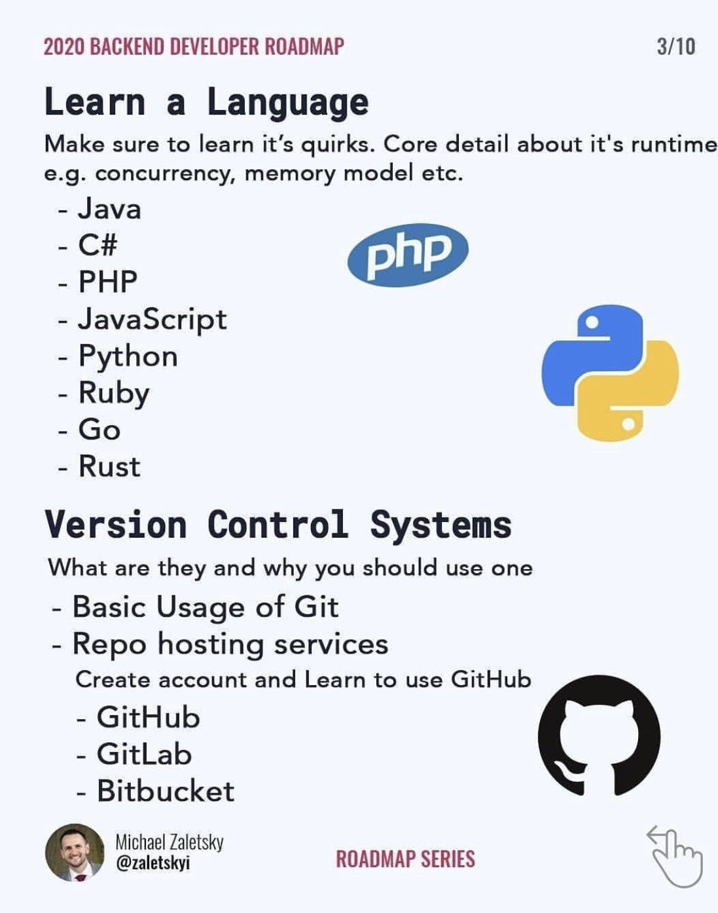

# BitAcademy Write Note

## `07월 06일`

### 자바 백앤드 전체 그림
- java programming
- Database programming - sql + jdbc programming
- x network programming
- Web Programming (Servlet/JSP)
- Framework (Spring MVC, Spring Boot)

이러한 순서로 배우면 된다.

-------------------------linux기반 ----------------------------





> 백앤드 개발자 과정
>> - 다 배우고 기업을 들어가야하는건 아니지만 들어가서 다 배울 것임
>> - 기본적으로 웹 어플리케이션 정도는 만들 수 있어야 함
>> - 어느정도 코딩이 되면 그 다음 성능 향상 etc..

<br></br>

# 데이터베이스

## 쿼리 실행 순서
1. From table
2. where condition
3. select column
4. order by
    - asc 오름차순 default 
        - ex) 1 2 3 4 5
    - desc 내림차순 
        - ex) 5 4 3 2 1
---
## 통계 함수
- avg, min, max, count, sum etc..

`table: employees`
| emp_no | salary | hire_date|
|:---:|:---:|:---:|
|1|100|~|
|1|200|~|
|2|300|~|
|3|400|~|
|4|100|~|

```sql
select sum(salary), emp_no
from employees;
```
- select 절에 그룹함수가 있는 경우, 어떤 컬럼도 select절에 올 수 없다.
- emp_no 는 아무 의미없다. -> 오류임.
> group by의 필요성
> group by 는 having을 통해 condition 생성

---
## query실행 순서
```
1. From table
2. Where cond
3. Group by column
4. Having cond
5. Order by
6. select
```

<br>

---
## Join
---
## `07월 07일`
---

- WorkBench ERD 만드는 방법


> 데이터베이스 이름과 같게 스키마를 설정해야한다.


> ADD ERD


> add table


> 일 대 다 관계 생성
>> 다 관계를 먼저 클릭


> continue 클릭
>> 데이터베이스에 삽입
>>> 모두 초록색 표시가 뜨면 완료

---
## DDL (Date Definition Language)
--- 
## transaction
- 강사님이 해준 트랜잭션 예시 정리가 필요함 .
--- 
## JDBC
### `- 자바 프로그램내에서 SQL문을 실행하기 위한 자바 API`

자바에서는 Connection c = new getConnection()이랑 
query만 날리는 것만 구현하도록 하고 

mysql 과 oracle 등에서 get connection을 구현하도록 만든다.

JDBC driver : 

mysql DBMS와 연결하기 위해서는 mysql JDBC dirver가 필요함 .

우리는 JDBC의 프로그램 인터페이스를 코딩하면 됨. 

driver manager로 dirver를 관리

mysql 과 oracle의 패키지 이름정도는 알아야한다. 

### `-JDBC Eclipse에서 사용하기`
1. Maven Module생성
2.  [mvrepository](https://mvnrepository.com/artifact/org.mariadb.jdbc/mariadb-java-client) 사이트에서 사용할 버전에 대한 dependency를 pom.xml에 dependencies태그 안에 추가
```xml
<project xmlns="http://maven.apache.org/POM/4.0.0" xmlns:xsi="http://www.w3.org/2001/XMLSchema-instance" xsi:schemaLocation="http://maven.apache.org/POM/4.0.0 https://maven.apache.org/xsd/maven-4.0.0.xsd">
  <modelVersion>4.0.0</modelVersion>
  <parent>
    <groupId>com.bit.mariaDB</groupId>
    <artifactId>mariaDB</artifactId>
    <version>0.0.1-SNAPSHOT</version>
  </parent>
  <artifactId>jdbc_practice</artifactId>
  <!-- https://mvnrepository.com/artifact/org.mariadb.jdbc/mariadb-java-client -->
	<dependencies>
		<dependency>
		    <groupId>org.mariadb.jdbc</groupId>
		    <artifactId>mariadb-java-client</artifactId>
		    <version>3.0.8</version>
		</dependency>
	</dependencies>
</project>
```
> 3.0.8 버전을 사용하였음.
3. pom.xml을 바꿨으니 update project클릭


---
## `0710`
---
### - 보통의 웹사이트 로그인 방법

```java
String SQL = "select no,name " + 
    "from user " + 
    "where id='" + id + "'" + 
    "and pwd='" + pwd "'";
```
> 이러한 쿼리를 날려서 로그인한다.

    - 위 쿼리의 문제점
        로그인창에 
        'or 2-1=1 or "= ' 와 같은 쿼리를 날려 모든 사용자의 정보를
        볼 수 있다.
> 이러한 것을 SQL Injection이라고 함.
--- 
### - Solution : PreparedStatement

1. preparedStatement를 JDBC 드라이버에 준비를 시킴
2. binding을 통해 ?,? 자리를 필요한 정보로 bind시켜줌 
3. 그럼 드라이버가 쿼리를 만들어 execute한다. 
--- 
### DAO (Data Access Object)

- DB를 사용해 데이터를 조회하거나 조작하는 기능을 전담하도록 만든 Object
- DB CRUD를 전담하는 Controller
- request, response 순서
    - Request : Application -> DAO -> DB
    - Response : DB -> DAO -> APP
--- 
### DAO-VO 패턴 (Employees테이블 실습)

`Hr`

hr.dao

|-- EmployeeDao

hr.dao.test (본체를 만들기 전에 test)

|-- EmployeeDaoTest

hr.vo

|-- EmployeeVO

hr.main

|-- HRMain

---
TDD : 테스트 코드를 만들면서 설계하면서 만든다.

--- 
### `Emaillst`
emaillist.vo

|--- EmaillistVo

emaillist.dao

|--- EmaillistVo

emaillist.dao.test


emaillist.main

---

### `BookShop`


