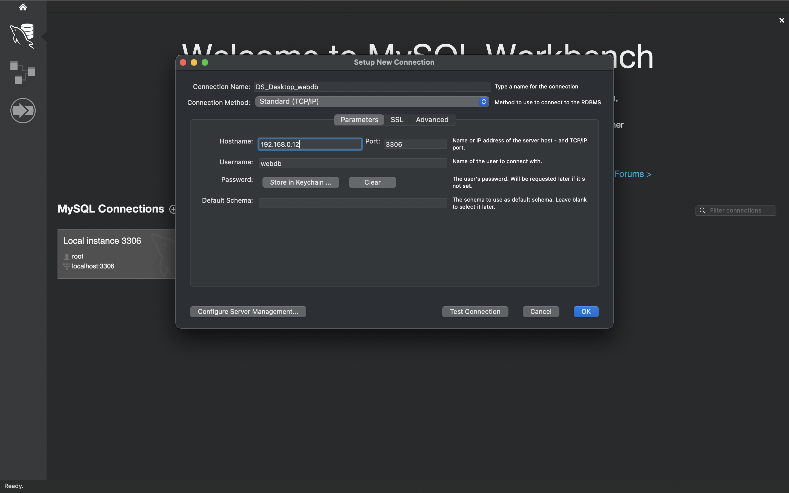
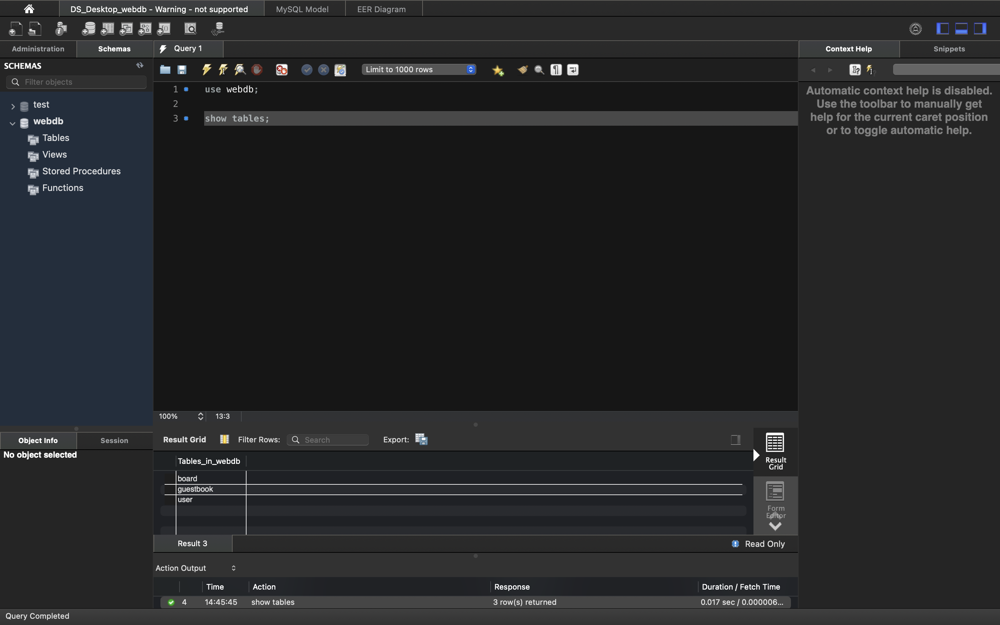

# MySQL Workbench에 연결하기
### 방화벽에 MariaDB 포트(기본 3306번 포트)를 허용하는 규칙 추가
```bash
# sudo firewall-cmd --zone=public --add-port=3306/tcp --permanent

# sudo firewall-cmd --reload
```
---
- MySQL Connection 추가 (+ 버튼 아이콘 클릭)
- 서버에서 hostname -I 옵션을 통해 아이피 주소 확인
- 파라미터 넣기



- Test Connection 후 DB 계정 비밀번호 입력
---
### test


